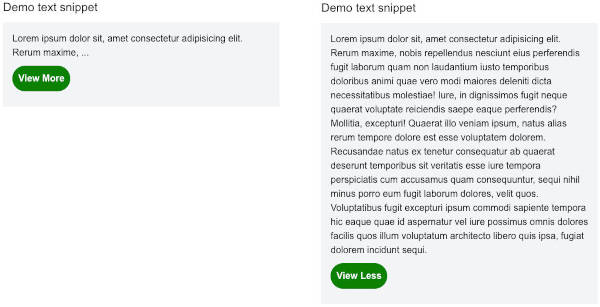

# Description

Text-cut is a simple React text truncator that limits the display of text based on a maximum set length for words. When the text exceeds this length, a reader can toggle the text expansion button to view the full text or less.

## Features

- Truncates text to a specified maximum word length.
- Provides "View More" and "View Less" functionality.
- Supports external links to full posts.
- Easily customizable text for expanding/collapsing views (You can customize the displayed text on the button with props for better SEO).
- Customizable background colors for the view more or less button.

## Props

The text truncator takes the following props:

- `body` (string, compulsory): The text that you want to truncate.

- `length` (number, compulsory): The maximum length of words to display.

- `viewMoreText` (string, optional): Text to be displayed for the "View More" button.

- `viewLessText` (string, optional): Text to be displayed for the "View Less" button.

- `useLink` (boolean, optional): If set to true, clicking "View More" will lead to the `postLink`. If false, the post will be expandable/collapsible in place.

- `postLink` (string, optional): The URL to the full post if it is available on another page (You should add this prop if you are using the useLink prop).

- `viewFullPostText` (string, optional): Custom text for linking to view the full post.

- `bgColor` (string, optional): Sets background color for the text snippet expansion (View more or less) button, eg "green". Default is "green".

- `textColor` (string, optional): Sets text color for the text displayed in the button (view more or less), eg "blue".

- `buttonBR` (string, optional): Sets border radius for buttons. Options are "small" (border radius of 5px) and "medium" (border radius of 25px). Default is "small".

## Screenshot



## Installation

To install, run:

```bash
npm install text-cut
```

## Sample Usage

### Below is an example of how to use TextCut in a React application with TypeScript (requires React version ^18 or ^19).

```typescript
import React from 'react';
import { TextCut } from 'text-cut';

export default function Page() {
    const text: string = "Lorem ipsum dolor sit, amet consectetur adipisicing elit. Rerum maxime, nobis repellendus nesciunt eius perferendis fugit laborum quam non laudantium iusto temporibus doloribus animi quae vero modi maiores deleniti dicta necessitatibus molestiae! Iure, in dignissimos fugit neque quaerat voluptate reiciendis saepe eaque perferendis? Mollitia, excepturi! Quaerat illo veniam ipsum, natus alias rerum tempore dolore est esse voluptatem dolorem. Recusandae natus ex tenetur consequatur ab quaerat deserunt temporibus sit veritatis esse iure tempora perspiciatis cum accusamus quam consequuntur, sequi nihil minus porro eum fugit laborum dolores, velit quos. Voluptatibus fugit excepturi ipsum commodi sapiente tempora hic eaque quae id aspernatur vel iure possimus omnis dolores facilis quos illum voluptatum architecto libero quis ipsa, fugiat dolorem incidunt sequi.";

    return (
        <div className='mx-auto max-w-[97%]'>
            <h1 className='text-xl md:text-2xl mb-3'>Demo text snippet</h1>
            <div className="p-4 bg-gray-100 text-black">
                <TextCut body={text} length={10} bgColor="blue" />
            </div>
        </div>
    );
}
```
